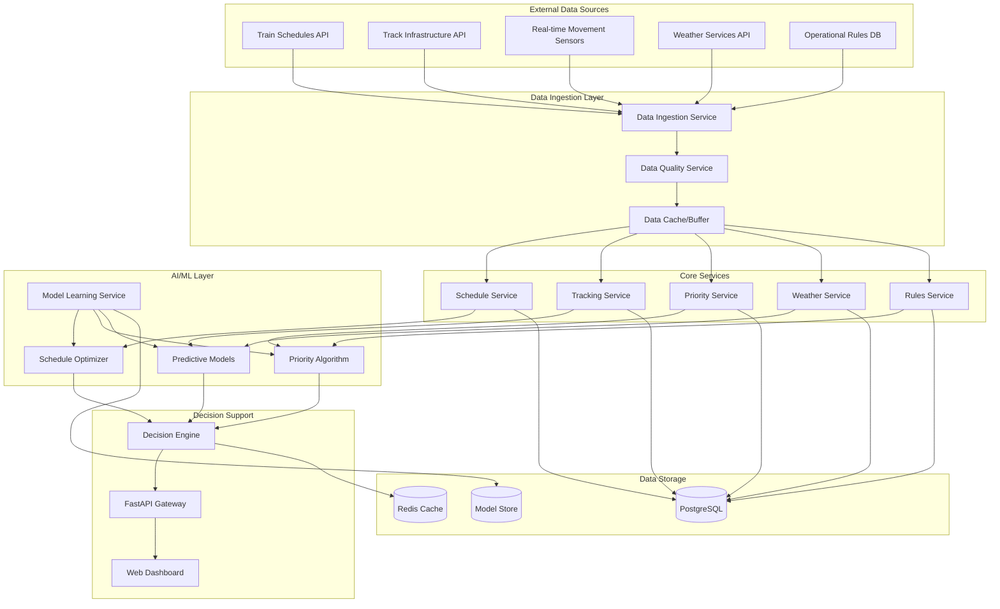

# Design Document

## Overview

The AI-powered Train Management Decision Support System (DSS) is designed as a microservices-based application using FastAPI and PostgreSQL. The system leverages machine learning algorithms to automate train scheduling, optimize crossing priorities, and provide intelligent decision support to train traffic controllers. The architecture supports real-time data processing, continuous learning, and scalable AI model deployment.

## Architecture

### High-Level Architecture



### Technology Stack

- **Backend Framework**: FastAPI (Python 3.11+)
- **Database**: PostgreSQL 15+ with TimescaleDB extension for time-series data
- **Caching**: Redis for real-time data and session management
- **ML Framework**: scikit-learn, TensorFlow/PyTorch for deep learning models
- **Message Queue**: Celery with Redis broker for async processing
- **API Documentation**: Automatic OpenAPI/Swagger documentation via FastAPI
- **Monitoring**: Prometheus + Grafana for system metrics
- **Containerization**: Docker with Docker Compose for development

## Components and Interfaces

### 1. Data Ingestion Service

**Purpose**: Handles real-time data collection from multiple external sources

**Key Features**:
- Asynchronous data collection using asyncio
- Data validation and transformation
- Error handling and retry mechanisms
- Rate limiting and backpressure management

**API Endpoints**:
- `POST /api/v1/ingest/schedules` - Receive schedule updates
- `POST /api/v1/ingest/movements` - Receive real-time train positions
- `POST /api/v1/ingest/weather` - Receive weather data
- `GET /api/v1/ingest/status` - Check ingestion service health

### 2. Schedule Optimization Service

**Purpose**: AI-powered automatic schedule generation and optimization

**Key Features**:
- Genetic algorithm for schedule optimization
- Constraint satisfaction problem (CSP) solver
- Multi-objective optimization (efficiency, safety, punctuality)
- Real-time schedule adjustment

**ML Models**:
- **Schedule Predictor**: LSTM model for predicting optimal departure/arrival times
- **Conflict Resolver**: Decision tree ensemble for resolving scheduling conflicts
- **Delay Propagation Model**: Graph neural network for predicting delay impacts

**API Endpoints**:
- `POST /api/v1/schedule/optimize` - Generate optimal schedule
- `PUT /api/v1/schedule/{train_id}/adjust` - Adjust individual train schedule
- `GET /api/v1/schedule/conflicts` - Get current scheduling conflicts

### 3. Priority Management Service

**Purpose**: Automated train priority resolution at crossings and junctions

**Key Features**:
- Rule-based priority engine
- Dynamic priority adjustment based on delays
- Emergency override capabilities
- Multi-criteria decision analysis (MCDA)

**Priority Factors**:
- Train type (passenger, freight, express, local)
- Schedule criticality and delay status
- Passenger load and service importance
- Maintenance windows and track availability

**API Endpoints**:
- `POST /api/v1/priority/resolve` - Resolve crossing priority conflict
- `GET /api/v1/priority/rules` - Get current priority rules
- `PUT /api/v1/priority/emergency` - Set emergency priority override

### 4. Real-time Tracking Service

**Purpose**: Monitor train positions and movements in real-time

**Key Features**:
- WebSocket connections for real-time updates
- Geofencing for station and crossing detection
- Speed monitoring and safety alerts
- Communication loss detection

**API Endpoints**:
- `GET /api/v1/tracking/trains` - Get all train positions
- `GET /api/v1/tracking/train/{train_id}` - Get specific train location
- `WebSocket /ws/tracking` - Real-time position updates

### 5. Decision Engine

**Purpose**: Central decision-making component that coordinates all AI services

**Key Features**:
- Multi-agent decision framework
- Confidence scoring for AI recommendations
- Human-in-the-loop override capabilities
- Decision audit trail and explainability

**API Endpoints**:
- `POST /api/v1/decisions/schedule` - Get scheduling decision
- `POST /api/v1/decisions/priority` - Get priority decision
- `GET /api/v1/decisions/history` - Get decision history
- `POST /api/v1/decisions/override` - Manual override decision

## Data Models

### Core Database Schema

```sql
-- Train Types and Classifications
CREATE TABLE train_types (
    id SERIAL PRIMARY KEY,
    name VARCHAR(50) NOT NULL,
    priority_weight INTEGER DEFAULT 1,
    max_speed INTEGER,
    passenger_capacity INTEGER,
    created_at TIMESTAMP DEFAULT NOW()
);

-- Train Schedules
CREATE TABLE train_schedules (
    id SERIAL PRIMARY KEY,
    train_id VARCHAR(20) NOT NULL,
    train_type_id INTEGER REFERENCES train_types(id),
    route_id VARCHAR(50),
    scheduled_departure TIMESTAMP,
    scheduled_arrival TIMESTAMP,
    actual_departure TIMESTAMP,
    actual_arrival TIMESTAMP,
    status VARCHAR(20) DEFAULT 'scheduled',
    priority_level INTEGER DEFAULT 1,
    created_at TIMESTAMP DEFAULT NOW(),
    updated_at TIMESTAMP DEFAULT NOW()
);

-- Track Infrastructure
CREATE TABLE track_segments (
    id SERIAL PRIMARY KEY,
    segment_id VARCHAR(50) UNIQUE NOT NULL,
    start_station VARCHAR(100),
    end_station VARCHAR(100),
    length_km DECIMAL(8,2),
    max_speed INTEGER,
    track_type VARCHAR(30),
    status VARCHAR(20) DEFAULT 'operational',
    maintenance_window JSONB,
    created_at TIMESTAMP DEFAULT NOW()
);

-- Crossings and Junctions
CREATE TABLE crossings (
    id SERIAL PRIMARY KEY,
    crossing_id VARCHAR(50) UNIQUE NOT NULL,
    location POINT,
    crossing_type VARCHAR(30),
    connected_segments JSONB,
    priority_rules JSONB,
    signal_status VARCHAR(20) DEFAULT 'green',
    created_at TIMESTAMP DEFAULT NOW()
);

-- Real-time Train Positions (TimescaleDB hypertable)
CREATE TABLE train_positions (
    train_id VARCHAR(20) NOT NULL,
    timestamp TIMESTAMP NOT NULL,
    latitude DECIMAL(10,8),
    longitude DECIMAL(11,8),
    speed_kmh DECIMAL(5,2),
    direction DECIMAL(5,2),
    segment_id VARCHAR(50),
    signal_status VARCHAR(20),
    communication_status VARCHAR(20) DEFAULT 'active'
);

SELECT create_hypertable('train_positions', 'timestamp');

-- Weather Data (TimescaleDB hypertable)
CREATE TABLE weather_data (
    location_id VARCHAR(50) NOT NULL,
    timestamp TIMESTAMP NOT NULL,
    temperature DECIMAL(4,1),
    humidity DECIMAL(5,2),
    wind_speed DECIMAL(5,2),
    visibility_km DECIMAL(5,2),
    precipitation_mm DECIMAL(5,2),
    weather_condition VARCHAR(50),
    severity_level INTEGER DEFAULT 1
);

SELECT create_hypertable('weather_data', 'timestamp');

-- Operational Rules
CREATE TABLE operational_rules (
    id SERIAL PRIMARY KEY,
    rule_name VARCHAR(100) NOT NULL,
    rule_type VARCHAR(50),
    conditions JSONB,
    actions JSONB,
    priority INTEGER DEFAULT 1,
    active BOOLEAN DEFAULT true,
    created_at TIMESTAMP DEFAULT NOW()
);

-- AI Model Decisions and Audit Trail
CREATE TABLE ai_decisions (
    id SERIAL PRIMARY KEY,
    decision_type VARCHAR(50),
    input_data JSONB,
    model_output JSONB,
    confidence_score DECIMAL(3,2),
    human_override BOOLEAN DEFAULT false,
    override_reason TEXT,
    timestamp TIMESTAMP DEFAULT NOW(),
    model_version VARCHAR(20)
);

-- Priority Conflicts and Resolutions
CREATE TABLE priority_conflicts (
    id SERIAL PRIMARY KEY,
    crossing_id VARCHAR(50) REFERENCES crossings(crossing_id),
    conflicting_trains JSONB,
    resolution_algorithm VARCHAR(50),
    resolved_priority JSONB,
    resolution_time TIMESTAMP,
    manual_override BOOLEAN DEFAULT false,
    created_at TIMESTAMP DEFAULT NOW()
);
```

### ML Model Data Structures

```python
from pydantic import BaseModel
from typing import List, Optional, Dict
from datetime import datetime
from enum import Enum

class TrainType(str, Enum):
    PASSENGER_EXPRESS = "passenger_express"
    PASSENGER_LOCAL = "passenger_local"
    FREIGHT_PRIORITY = "freight_priority"
    FREIGHT_REGULAR = "freight_regular"
    MAINTENANCE = "maintenance"

class TrainStatus(str, Enum):
    SCHEDULED = "scheduled"
    RUNNING = "running"
    DELAYED = "delayed"
    CANCELLED = "cancelled"
    COMPLETED = "completed"

class ScheduleOptimizationInput(BaseModel):
    trains: List[Dict]
    constraints: Dict
    weather_conditions: Optional[Dict]
    track_availability: Dict
    optimization_objectives: List[str]

class PriorityDecisionInput(BaseModel):
    crossing_id: str
    conflicting_trains: List[Dict]
    current_delays: Dict
    weather_impact: Optional[float]
    emergency_status: bool = False

class AIDecisionOutput(BaseModel):
    decision_id: str
    recommendation: Dict
    confidence_score: float
    reasoning: List[str]
    alternative_options: Optional[List[Dict]]
    timestamp: datetime
```

## Error Handling

### Error Categories and Responses

1. **Data Quality Errors**
   - Invalid sensor data → Use last known good value + alert
   - Missing weather data → Use historical averages + reduced confidence
   - Communication loss → Switch to predictive mode + manual notification

2. **AI Model Errors**
   - Model prediction failure → Fallback to rule-based system
   - Low confidence scores → Request human validation
   - Model drift detection → Trigger automatic retraining

3. **System Integration Errors**
   - External API failures → Use cached data + degraded mode operation
   - Database connection issues → Redis failover + async recovery
   - Real-time processing delays → Priority queue management

### Error Response Format

```python
class ErrorResponse(BaseModel):
    error_code: str
    error_message: str
    error_category: str
    suggested_action: str
    fallback_available: bool
    timestamp: datetime
```

## Testing Strategy

### Unit Testing
- **Service Layer**: Test individual AI algorithms and business logic
- **Data Layer**: Test database operations and data validation
- **API Layer**: Test endpoint functionality and input validation
- **ML Models**: Test model accuracy, performance, and edge cases

### Integration Testing
- **Data Pipeline**: End-to-end data flow from ingestion to decision output
- **AI Workflow**: Complete AI decision-making process validation
- **External APIs**: Mock external services and test error scenarios
- **Real-time Processing**: WebSocket connections and streaming data

### Performance Testing
- **Load Testing**: Simulate high-volume train operations
- **Stress Testing**: Test system behavior under extreme conditions
- **ML Performance**: Model inference time and accuracy benchmarks
- **Database Performance**: Query optimization and indexing validation

### AI/ML Specific Testing
- **Model Validation**: Cross-validation, holdout testing, A/B testing
- **Bias Detection**: Fairness testing across different train types and routes
- **Robustness Testing**: Adversarial inputs and edge case handling
- **Continuous Monitoring**: Model drift detection and performance degradation

### Test Data Strategy
- **Synthetic Data Generation**: Create realistic train operation scenarios
- **Historical Data**: Use anonymized real-world railway data for training
- **Simulation Environment**: Virtual railway network for testing
- **Edge Case Scenarios**: Emergency situations, extreme weather, system failures